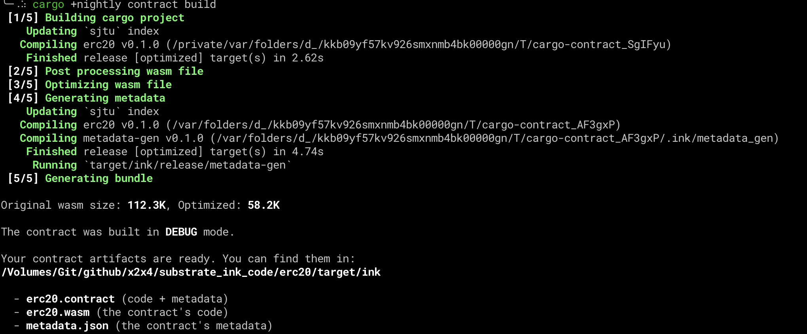
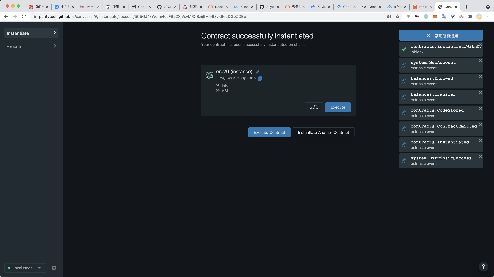
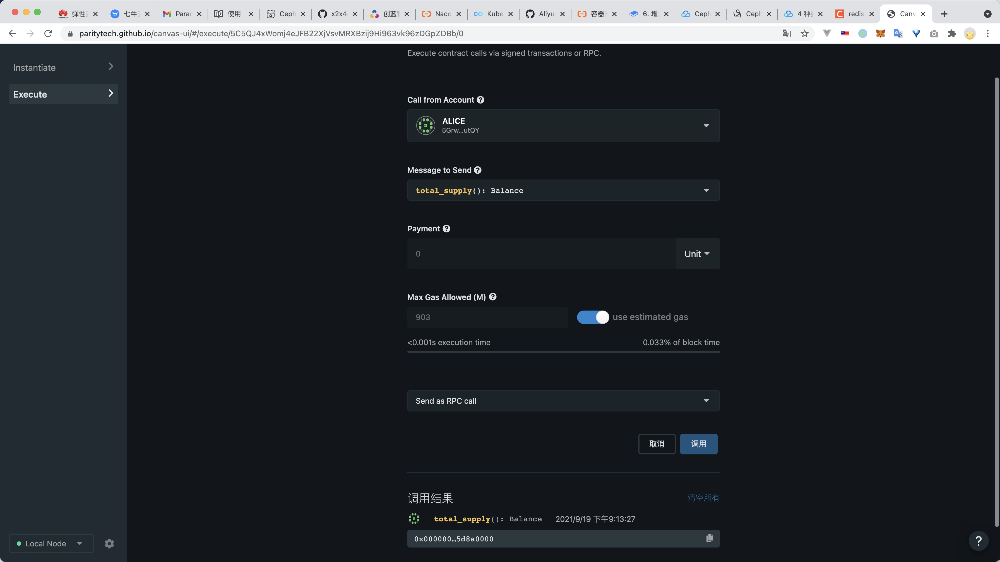
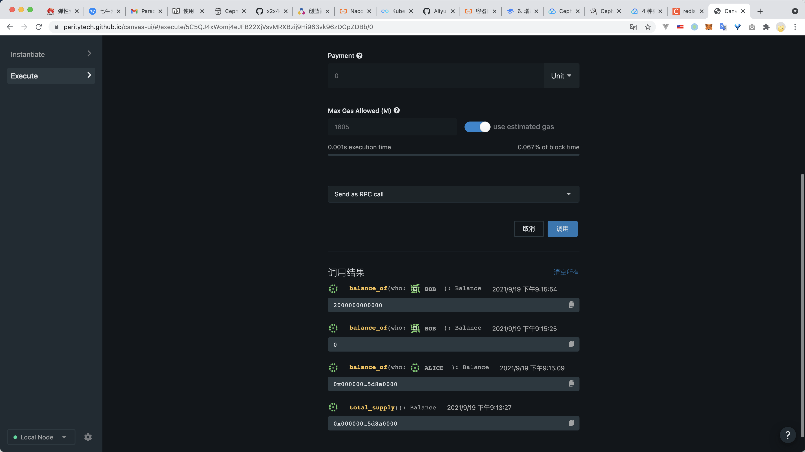
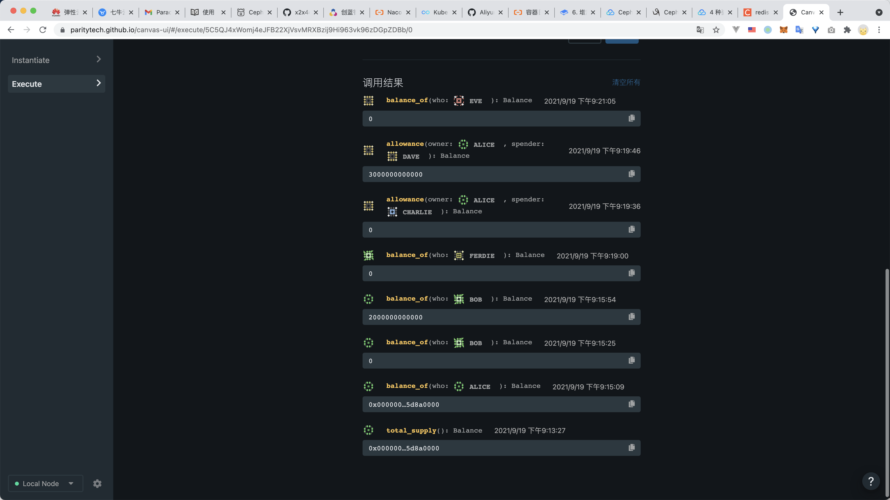
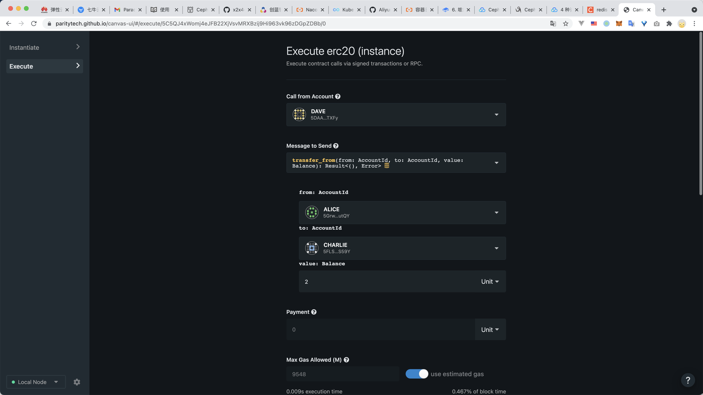

# Readme

编译成功截图

合约初始化成功

查询总供给

转账

Bob原来是0，Alice转了2个Unit给他，于是Bob有了2个

Alice给Dave授信了3个Unit

Dave 先试图向 Eve 转 5个Unit，实际并没有成功

Dave 然后调用Alice的授信向 CHARLIE 转了2个Unit

再次检查，CHARLIE余额为2个Unit了，Dave的Alice授信额度已经变成了1个Unit

合约测试成功